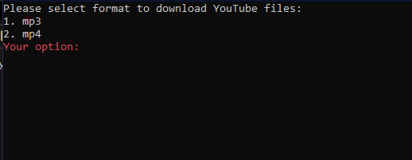

# YouTube-Downloader-2.0
#1. In first menu you choose if you want the file to be downloaded like .mp3 or .mp4

#2. In second menu you choose where the files will be downloaded, there's 5 options:
   1. Desktop
   2. Downloads
   3. Music
   4. Documents
   5. Videos

#3. In third menu you upload a YouTube video link. Enjoy!
